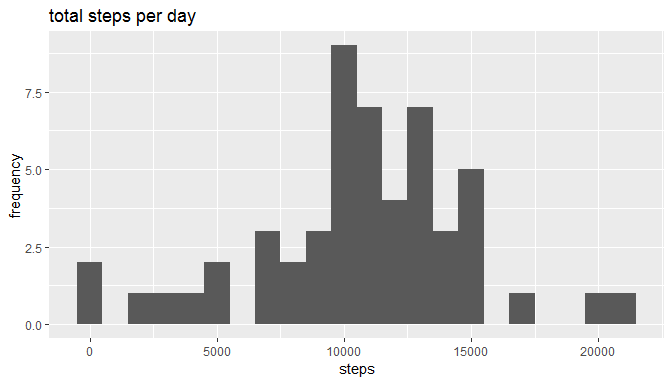
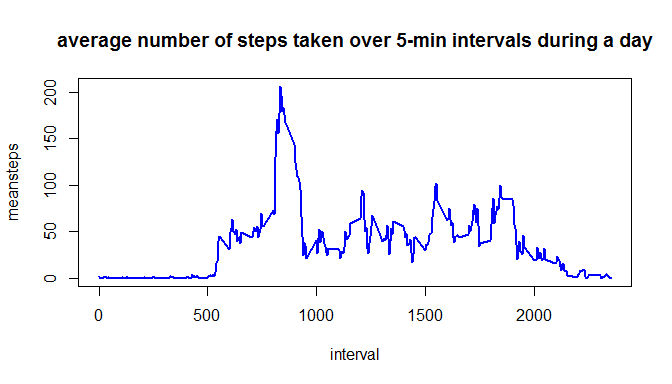
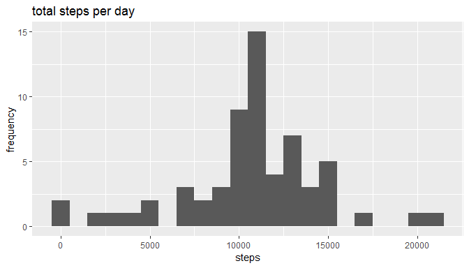
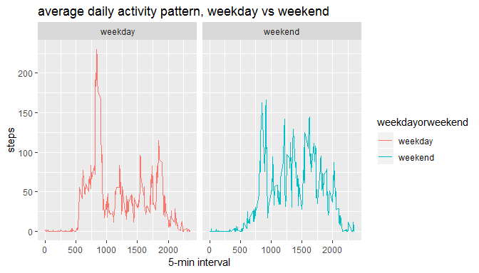

```r
library(knitr)
opts_chunk$set(echo=TRUE)
```

## Loading and preprocessing the data
First we need to unzip the data to obtain the .csv file.

```r
unzip('activity.zip')
```

Now read in the data in the .csv file into a data table.

```r
library('data.table')
activitydt <- fread('activity.csv')
```

## What is mean total number of steps taken per day?
1. calculate the total number of steps taken per day

```r
Tsteps <- aggregate(activitydt$steps,by=list(activitydt$date),FUN=sum)
names(Tsteps) <- c('date','steps')
```

2. plot a histogram of the total number of steps taken each day

```r
library(ggplot2)
ggplot(Tsteps,aes(x=steps)) +
    geom_histogram(binwidth=1000,na.rm=TRUE) +
    labs(title='total steps per day', x='steps', y='frequency')
```

<!-- -->

3. show the mean and median number of steps taken each day

```r
summary(Tsteps$steps)
```

```
##    Min. 1st Qu.  Median    Mean 3rd Qu.    Max.    NA's 
##      41    8841   10765   10766   13294   21194       8
```


## What is the average daily activity pattern?
1. make a time series plot of the average number of steps taken

```r
intvlsteps <- aggregate(steps~interval,data=activitydt,mean,na.rm=TRUE)
names(intvlsteps) <- c('interval','meansteps')
with(intvlsteps,plot(interval,meansteps,type='l',col='blue',lwd=2))
title(main='average number of steps taken over 5-min intervals during a day')
```

<!-- -->

2. find the 5-minute interval that, on average, contains the maximum number of steps

```r
intvlsteps$interval[which.max(intvlsteps$meansteps)]
```

```
## [1] 835
```


## Imputing missing values
1. find the number and fraction of NA's

```r
activitydt[is.na(steps),.N]
```

```
## [1] 2304
```

```r
mean(is.na(activitydt$steps))
```

```
## [1] 0.1311475
```

2. impute missing values using average of that interval

```r
library(plyr)
activitydt <- join(activitydt,intvlsteps,by='interval')
activitydt$steps[is.na(activitydt$steps)] <-
        round(as.numeric(activitydt$meansteps[is.na(activitydt$steps)]))
```

3. plot the histogram of the total number of steps taken each day after missing values are imputed

```r
Tsteps <- aggregate(activitydt$steps,by=list(activitydt$date),FUN=sum)
names(Tsteps) <- c('date','steps')
library(ggplot2)
ggplot(Tsteps,aes(x=steps)) +
    geom_histogram(binwidth=1000) +
    labs(title='total steps per day', x='steps', y='frequency')
```

<!-- -->


## Are there differences in activity patterns between weekdays and weekends?
1. create a new factor variable with two levels – weekday and weekend

```r
library('timeDate')
activitydt$date <- as.Date(as.character(activitydt$date))
activitydt <- data.table(activitydt)
activitydt[,isweekend := isWeekend(activitydt$date)]
activitydt[isweekend==TRUE,'weekdayorweekend'] <- 'weekend'
activitydt[isweekend==FALSE,'weekdayorweekend'] <- 'weekday'
```

2. make a panel plot comparing the average number of steps taken per 5-minute interval across weekdays and weekends

```r
intervaldt <-aggregate(steps~interval+weekdayorweekend,data=activitydt,mean)
ggplot(intervaldt, aes(x=interval, y=steps, color=weekdayorweekend)) +
    geom_line() + facet_grid(~weekdayorweekend) +
    labs(title = "average daily activity pattern, weekday vs weekend") +
    labs(x ="5-min interval",y ="steps")
```

<!-- -->
